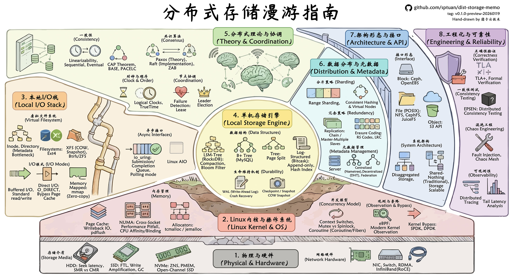

# 分布式存储漫游指南

  <em>分布式存储技术探索之旅 by SPtuan@团子云技术</em>

<picture>
  
</picture>

  
  

---

## 📚 关于本书

本漫游指南从现代数据中心硬件、单机 IO 性能出发，逐步探索分布式的存储产品的现状和技术点。

在笔者入门时，阅读了众多开发者的博客文章和技术讨论，受益匪浅。

但**始终困顿于没有一本系统的 "技能书"**，让学习者能够在起步之初，即能快速厘清整个技术栈的脉络和思想，从而放心大胆地打怪升级。故笔者逐步以开源形式编纂本书。

本书内容多为笔者自己曾有的疑惑，结合一手的工程见闻和调研，尽全力保证内容的新鲜度和实用性。

本书不妄图成为最权威、最深入的分布式存储教程，但求成为**最有趣、最接地气、最具备工程实践意义的一本《漫游指南》**，权作抛砖引玉，聊备各阶段读者研习之需。

谨以此书献给我爱的家人们，以及屏幕前热爱分布式技术的你。

## 🗺️ 漫游地图

*手工绘制，后续可能更新。您可以在[此链接](https://github.com/sptuan/dist-storage-memo/blob/master/static/dist-stroage-memo-map_v0.1.0-full.png)获取高清电子版。

## 🎯 适合读者

<table>
<tr>
<td width="50%">

**开发者**
- 分布式系统开发者
- 存储系统工程师
- 存储应用开发者

</td>
<td width="50%">

**学习者**
- 对存储技术感兴趣的学生和研究者
- 希望了解分布式存储架构的技术人员
- 正在准备面试材料的求职者

</td>
</tr>
</table>

## 📖 在线阅读

**[👉 立即开始阅读 👈](https://memo.steinslab.io/)**

## 📑 已更新文章索引

| 标题 | tags | 复杂度 |
|------|------|--------|
| [1. 硬件篇](https://memo.steinslab.io/hardware/) | 硬件, 性能基准 | ⭐️ |
| [2.1 同步 I/O (Sync I/O)](https://memo.steinslab.io/sync-io/sync-io/) | Sync I/O, POSIX | ⭐️⭐️ |
| [2.2 直接 I/O (Direct I/O)](https://memo.steinslab.io/sync-io/direct-io/) | Direct I/O, Page Cache | ⭐️⭐️ |
| [2.3 内存映射 I/O (mmap)](https://memo.steinslab.io/sync-io/mmap-io/) | mmap | ⭐️⭐️ |
| [2.4 线程池模式 (Thread Pool)](https://memo.steinslab.io/sync-io/thread-pool/) | 线程池, 并发 IO | ⭐️⭐️⭐️ |
| [2.5 小结](https://memo.steinslab.io/sync-io/summary/) | Sync I/O 小结 | ⭐️ |
| [3.2 Linux AIO](https://memo.steinslab.io/async-io/linux-aio/) | 异步 IO, libaio | ⭐️⭐️⭐️ |
| [3.3 Linux io_uring](https://memo.steinslab.io/async-io/io_uring/) | io_uring, 高性能 IO | ⭐️⭐️⭐️⭐️ |
| [3.4 Go 的磁盘 IO](https://memo.steinslab.io/async-io/golang-disk-io/) | Go, GMP, 磁盘 IO | ⭐️⭐️ |
| [3.5 小结](https://memo.steinslab.io/async-io/summary/) | Async I/O 小结 | ⭐️ |
| [4.1 混沌的分布式环境](https://memo.steinslab.io/dist-101/chaos/) | 分布式谬误, 失效建模 | ⭐️⭐️ |
| [4.2 时钟!! 顺序!!](https://memo.steinslab.io/dist-101/time-and-clocks/) | 逻辑时钟, 因果顺序 | ⭐️⭐️⭐️ |
| [4.3 CAP 定理](https://memo.steinslab.io/dist-101/cap/) | CAP | ⭐️⭐️ |
| [4.4 中登必备之复制与分区](https://memo.steinslab.io/dist-101/partition-and-replicate/) | 复制, 分区 | ⭐️⭐️⭐️ |
| [4.5 分布式存储形态与组件](https://memo.steinslab.io/dist-101/mods/) | 对象/块/文件存储, 组件 | ⭐️⭐️⭐️ |
| [4.6 动手做！你专属的分布式存储设计 CheckList](https://memo.steinslab.io/dist-101/checklist/) | 技术选型, CheckList | ⭐️⭐️ |
| [5.1 复制策略设计](https://memo.steinslab.io/storage-engine/replicate/) | 复制组, 编码 | ⭐️⭐️⭐️ |
| [5.3 性能-成本-可靠性之不可能三角](https://memo.steinslab.io/storage-engine/cost-perf-safety/) | 成本, 可靠性, 故障域 | ⭐️⭐️⭐️ |

*复杂度：⭐️ 入门 → ⭐️⭐️⭐️⭐️⭐️ 较难。*

## 📄 论文观点和翻译

| 标题 | tags | 复杂度 |
|------|------|--------|
| [RocksDB 存算分离: Disaggregating RocksDB](https://memo.steinslab.io/sys/rocksdb_disaggregating/) | RocksDB, 存算分离, LSM | ⭐️⭐️⭐️⭐️ |
| [FAST'26 \| LESS: 纠删码存储中 I/O 高效修复](https://memo.steinslab.io/sys/fast26-less/) | FAST, EC, RS, LESS | ⭐️⭐️⭐️⭐️ |
| [FAST'26 \| ACOS: 苹果 EB 级全球分布式对象存储](https://memo.steinslab.io/sys/fast26-acos/) | FAST, 对象存储, 地理复制, LRC | ⭐️⭐️⭐️ |
| [FAST'26 \| 华为云: 基于磁带的高性价比归档云存储](https://memo.steinslab.io/sys/fast26-tape/) | FAST, 磁带, 归档存储 | ⭐️⭐️⭐️⭐️ |
| [FAST'26 \| 从 SPECFS 看新时代 infra 开发者工作范式](https://memo.steinslab.io/sys/fast26-spec/) | SYSSPEC, LLM Coding, Vibe Coding | ⭐️⭐️ |

## 🤖 AI 场景分布式存储系统研究

| 标题 | tags | 复杂度 |
|------|------|--------|
| [FAST'26 论文导读 \| AITURBO: 在存算分离架构中给 AI 任务垫一层分布式读写缓存](https://memo.steinslab.io/ai-sys/fast26-aiturbo/) | FAST, AITURBO, 存算分离, AI I/O | ⭐️⭐️⭐️ |

## 🔍 专题：存储领域观察和思考

| 标题 | tags | 复杂度 |
|------|------|--------|
| [FAST 2002–2026：AI 时代来了，存储系统的问题变了吗？](https://memo.steinslab.io/review/fast-trends-2002-2026/) | FAST, 存储演进, 趋势总结 | ⭐️⭐️⭐️⭐️ |

##  贡献指南

| 🐛 发现错误 | 💡 提出建议 | 📝 内容贡献 | ⭐ 点赞支持 |
|:---:|:---:|:---:|:---:|
| [提交 Issue](https://github.com/sptuan/dist-storage-memo/issues) | [功能请求](https://github.com/sptuan/dist-storage-memo/issues) | [Pull Request](https://github.com/sptuan/dist-storage-memo/pulls) | [⭐ Star 项目](https://github.com/sptuan/dist-storage-memo) |

## 👨‍💻 关于作者

**SPtuan | 团子云技术**

*一名普通的工程师，最大的愿望是度过平静的时光*

  
  
  

---

### 📞 联系交流

💬 **技术讨论** · 📝 **内容建议** · 🐛 **问题反馈**

  <strong>Email:</strong> sptuan#steinslab.io <em>(# 替换为 @)</em> 
  <strong>Blog Website:</strong> <a href="https://steinslab.io">steinslab.io</a> 
  <strong>GitHub:</strong> <a href="https://github.com/sptuan/dist-storage-memo/issues">Issues & Discussions</a>

#### 👋 分布式存储交流闲聊群

<table>
<tr>
<td>
<picture>
  
</picture>
</td>
<td>
<picture>
  
</picture>
</td>
</tr>
</table>

世界很大，圈子很小！
让世界更热闹一些吧 (球球了)！
所有的读者都大大大欢迎！
您的反馈是我前进的动力！
WeChat: dangotech
**Make Distributed Storage GREAT AGAIN!**

### ⭐ 如果这个项目对您有帮助，请考虑给个 Star！

