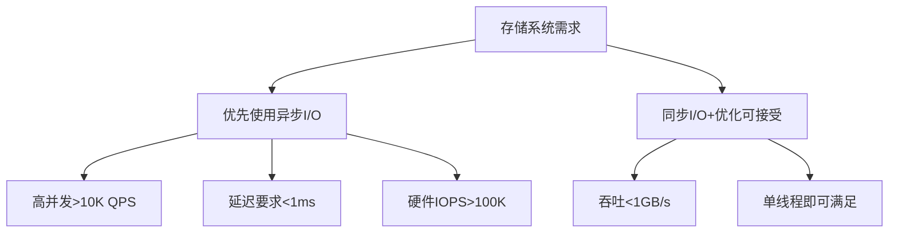

### 1 为什么从未见到 disk io 使用 epoll?

在 Linux 的世界中，一切皆文件的思想贯彻始终。然而文件也是有各种类型的。

| 类型标识符 | 文件类型               | 描述                                       | 典型示例                     |
|-----------|------------------------|--------------------------------------------|-----------------------------|
| -         | Regular File（普通文件） | 存储在磁盘上的标准数据文件（文本、二进制、压缩包等） | /etc/passwd, app.exe, data.zip |
| b         | Block Device（块设备）   | 按数据块访问的设备（有缓冲，支持随机访问）    | /dev/sda, /dev/nvme0n1      |
| s         | Socket（套接字）         | 进程间通信的端点（网络或本地）               | /run/docker.sock            |
| ...         | ... | ...            |                              |

本地文件的 IO 操作的是 Regular File，它永远都是可就绪的。

POSIX 允许：普通文件的 O_NONBLOCK 可能被忽略（多数实现中无效）[^posix_non_blocking]。因此，使用对其使用 epoll 没有意义。

普通文件的读写操作在传统内核中总是就绪（从内核视角看，磁盘 I/O 的阻塞发生在底层驱动，而非文件描述符层面）。即使设置 O_NONBLOCK，read()/write() 仍会因等待磁盘操作而阻塞。

继续阅读相关文章[^regular_blocking]。

注：有些高性能存储系统会实现自己的通信网络栈，涉及到网络通信，自然可能使用 epoll 技术。本节只讨论本地文件 IO。

[^posix_non_blocking]: [posix open - IEEE Std 1003.1-2017](https://pubs.opengroup.org/onlinepubs/9699919799/functions/open.html)
[^regular_blocking]: [为什么epoll不支持磁盘IO](https://www.pulpcode.cn/2021/04/03/regular-files-with-epoll/)

### 2 我真的有必要使用异步 IO 吗？

工程没有银弹。笔者认为，只有明确需要处理超高负载、延迟要求较低的系统，以及使用同步 I/O 无法榨干硬件性能；或者计算任务混合部署时，才需要引入异步 IO。

同时，开发者需要意识到，异步 I/O ≠ 更高性能。若系统已经达到了硬件能力，更换 IO 模型也几乎不可能令吞吐翻倍，往往是需要考虑更合理的 IO 系统模式设计。

异步 I/O 打破了天然人类思维的 “顺序流程”。整个系统可能需要引入 async，以及回调/状态机/协程；需要引入智能指针在整个异步过程中管理 IO buf 的生命周期等等。这些都增大了调试、理解的难度。(试想一下在 gdb 栈和日志中调查一个充满了回调系统的非预期行为…)。

